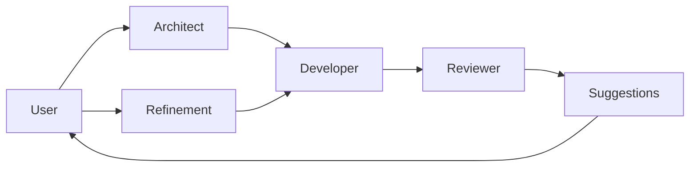

# Multi-Agent Coder
### AI Software Engineering Workspace

Multi-Agent Coder is a collaborative AI ecosystem designed to simulate the complexities and rigors of a professional software development lifecycle. It moves beyond simple "prompt-to-code" generation by orchestrating specialized agents that design, build, and verify software together.

## Project Philosophy
Traditional AI coding tools often operate in a single-pass, "black box" workflow:
`Prompt → Code`

Multi-Agent Coder follows a multi-stage **Software Engineering Philosophy**:
`Prompt → Planning → Implementation → Review → Suggestions → Refinement → Improved Code`

The objective is to move away from simple code completion toward a system that thinks architecturally, implements meticulously, and validates continuously. We prioritize **separation of concerns**, **architecture-first thinking**, and **iterative improvement**.

## Why Multi-Agent Coder?
While tools like ChatGPT, GitHub Copilot, and Cursor are excellent for code completion and chat-based assistance, Multi-Agent Coder is built for autonomous, structured development:

- **Architect before Developer**: No code is written without a structural plan.
- **Dedicated Reviewer**: Every implementation is checked by a separate agent with rejection criteria.
- **Shared Memory**: The system remembers its own plans and history, allowing for surgical code updates.
- **Iterative Refinement**: Instead of rewriting from scratch, the system modifies existing code based on targeted feedback.
- **Suggested Improvements**: Proactive analysis of generated code to offer the next logical steps.
- **Multi-Provider Agility**: Seamlessly switch between local (Ollama) and cloud (OpenRouter) LLMs.

## Human-in-the-Loop Development
The developer remains the pilot. The system is designed to collaborate with the user, evolving the code incrementally through a multi-turn dialogue:

1. **User**: "Create a login endpoint."
2. **System**: Generates base implementation.
3. **User**: "Add JWT."
4. **System**: Refines existing code to inject JWT logic.
5. **User**: "Improve validation."
6. **System**: Updates the Pydantic models and logic.

The system empowers the user to guide the evolution of the software step-by-step.

## Visual Workflow

## Agent Roles

| Agent | Responsibility |
| :--- | :--- |
| **Architect** | Designs the plan, selects libraries, and sets technical constraints. |
| **Developer** | Implements runnable, commented code based on the Architect's blueprint. |
| **Reviewer** | Meticulously validates code against requirements and quality standards. |

## The Refinement Loop
Unlike typical AI coders that restart on every prompt, this platform persists the context:
1. **Memory**: Loads existing code, architecture, and refinement history.
2. **Specialized Context**: The Developer receives the previous state and applies surgical modifications.
3. **Validation**: The Reviewer ensures the refinement satisfies the new request without breaking previous logic.

## AI Providers

### OpenRouter
**Recommended for: High-Quality Reasoning & Production.**
OpenRouter provides access to the world's most powerful models (Claude 3.5, GPT-4o), which are ideal for the complex logic required by the multi-agent workflow.

### Ollama
**Recommended for: Privacy, Cost, & Offline Development.**
Ollama allows you to run state-of-the-art coding models (like Qwen2.5-Coder) locally on your hardware, ensuring your source code never leaves your machine.

## Design Principles
- **Transparency**: Every agent's thought process is visible in real-time logs.
- **Modularity**: Easy to add new agents or switch providers.
- **Provider Independence**: Support for both local and cloud LLMs.
- **Incremental Improvement**: Favor surgical updates over total rewrites.
- **Real-Time Feedback**: Persistent WebSocket connection for instant updates.
- **User Control**: The user can interrupt, refine, or clear the workspace at any time.

## Current Scope
The platform currently supports:
- **Multi-agent orchestration** (Architect, Developer, Reviewer).
- **Iterative refinement** of existing code.
- **Shared memory** across sessions.
- **OpenRouter & Ollama** provider integration.
- **Proactive suggestions** panel.
- **Real-time streaming** of logs and code.
- **Execution control** (Stop/Cancel support).

## Future Vision
- **Security Agent**: Automated vulnerability and secret scanning.
- **Tester Agent**: Unit and integration test generation.
- **GitHub Integration**: Direct PR creation and code pushing.
- **Multi-file project generation**: Moving beyond single-file implementations.
- **Deployment automation**: One-click cloud deployment.

## Technical Stack
- **API**: FastAPI (Python)
- **UI**: React 18, TypeScript, TailwindCSS
- **Communication**: WebSockets (Real-time)
- **State Management**: Pydantic Models & Shared Memory
