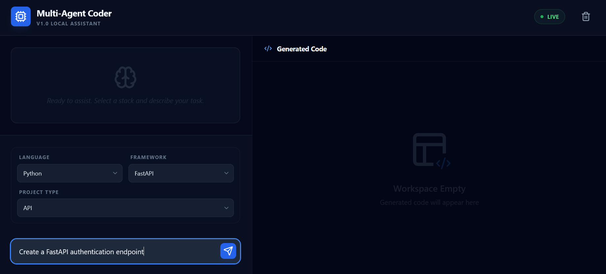
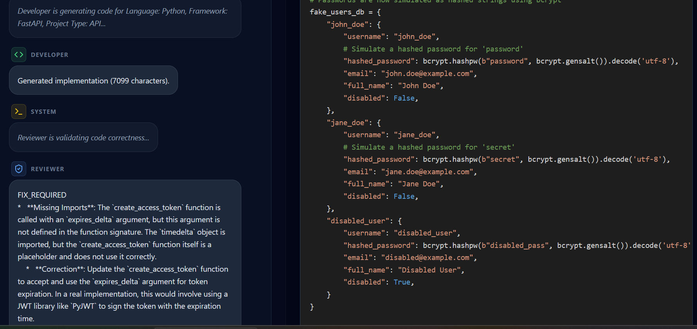
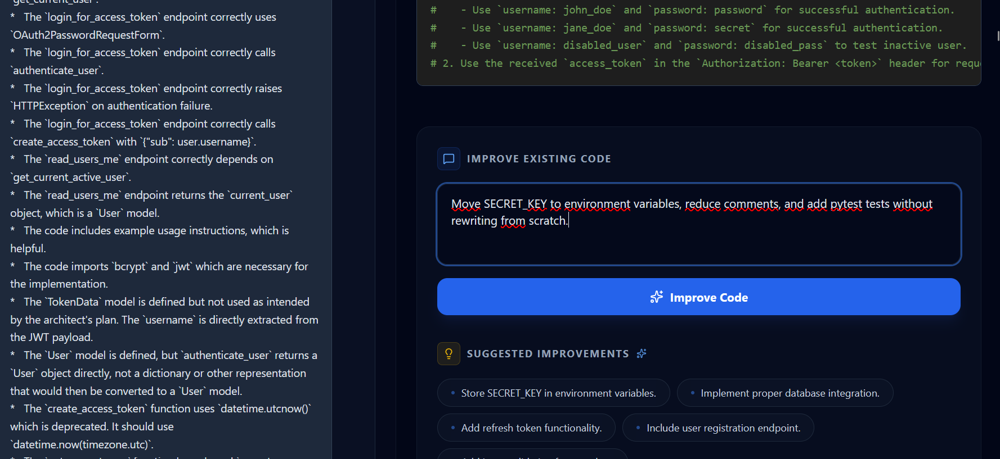

# Multi-Agent Coder
### AI-Assisted Coding Workspace


## Status
🚧 **Active Development**

Multi-Agent Coder is currently under active development.

**Current focus:**
- Agent orchestration logic
- Iterative refinement workflows
- OpenRouter & Ollama provider integration
- User experience improvements for long-form prompts

**Planned:**
- Multi-file project generation
- Dedicated Security & Tester agents
- Deployment automation templates

## 🚀 The Vision
An AI-assisted coding workspace built around collaborative agents and iterative code refinement. Multi-Agent Coder mimics a professional software development lifecycle where specialized agents—**Architect**, **Developer**, and **Reviewer**—collaborate in real-time to transform natural language requirements into structured code implementations.

## ✨ Key Features
- **Architect-Led Design**: Every implementation begins with a structural blueprint, ensuring logical planning before code generation.
- **Iterative Refinement**: Progressively improve, bug-fix, or extend existing code through a multi-turn conversational workflow.
- **Provider Agility**: Full support for both **OpenRouter** (cloud, high-performance) and **Ollama** (private, local) backends.
- **Real-Time Streaming**: WebSocket-based architecture for instant visibility into agent logs and implementation progress.
- **Proactive Suggestions**: Intelligent "next-step" recommendations generated after every successful implementation.
- **Execution Control**: Instant Stop/Cancel support to interrupt long-running generations.

## 🎯 Current Scope
The current version focuses on:
- **Single-file code generation**: High-quality implementation of scripts, components, and standalone modules.
- **Architecture planning**: Detailed blueprints generated by the Architect agent.
- **Automated review**: Code auditing and validation by the Reviewer agent.
- **Iterative evolution**: Refining existing generated code without starting from scratch.
- **Multi-agent collaboration**: Orchestrated handoffs between specialized roles.

## ⚠️ Current Limitations
- **Single-File Focus**: Multi-file project generation and full project scaffolding are not yet supported.
- **Human Review**: Generated code should be reviewed for security and logic before production use.
- **Incremental Growth**: Large applications require multiple refinement cycles rather than a single massive generation.
- **Application Assembly**: The platform focuses on code generation rather than complete end-to-end application assembly.

## 🖼️ Screenshots

### Dashboard
The main command center where project parameters are defined and code is rendered.
- **Stack Selection**: Define the language, framework, and project type to guide the agents.
- **Prompt Input**: A multi-line, auto-resizing input for complex requirements.
- **Generated Code Workspace**: A high-fidelity code viewer with syntax highlighting and refinement controls.
- **Connection State**: Real-time status monitoring of the backend orchestrator.



### Agent Workflow
Observe the collaborative intelligence of the agent team in real-time.
- **Architect**: Designs structural blueprints and identifies constraints.
- **Developer**: Streams implementation details based on the approved plan.
- **Reviewer**: Validates code quality and suggests fixes.
- **Real-Time Logs**: Full visibility into the thought process and interactions of each agent.



### Iterative Refinement
Evolve your implementation through user-guided feedback loops.
- **Refinement Input**: Describe specific changes, bug fixes, or new features to add to the existing code.
- **Suggestions Panel**: Context-aware recommendations for the next development steps.
- **Preserved Context**: Refinements are applied to the previous generated code, maintaining continuity.



## 🔄 Workflow Example
1. **User Input**: "Create a Python script for a thread-safe Singleton database connection."
2. **Architect**: Generates a blueprint explaining the Singleton pattern and thread-safety using `threading.Lock`.
3. **Developer**: Implements the code based on the blueprint.
4. **Reviewer**: Checks for potential race conditions or missing imports.
5. **Refinement**: User asks to "Add a method for connection pooling," and the system updates the existing script accordingly.

>>>>>>> 85c8f8e (docs: improve README, screenshots and project documentation)
## 🏗️ Architecture Overview
- **Backend**: FastAPI (Python) for the orchestration layer, utilizing WebSockets for real-time communication.
- **Frontend**: React (TypeScript) + Vite, featuring a responsive glassmorphism UI.
- **LLM Layer**: Decoupled provider abstraction for OpenAI-compatible APIs.

## 🛠️ Getting Started

### Prerequisites
- Python 3.9+
- Node.js 18+
- Ollama (Local) or OpenRouter API Key (Cloud)

### Installation

1. **Clone the Repository**:
   ```bash
   git clone https://github.com/loukili27/multi-agent-coder.git
   cd multi-agent-coder
   ```

2. **Backend Setup**:
   ```bash
   cd backend
   pip install -r ../requirements.txt
   python main.py
   ```

3. **Frontend Setup**:
   ```bash
   cd frontend
   npm install
   npm run dev
   ```

## 🤖 AI Providers

### OpenRouter
- **Recommended for Reasoning**: Higher-tier models (Claude 3.5 Sonnet, GPT-4o) provide superior architectural planning.
- **Recommended for Quality**: Best for complex, multi-agent orchestration tasks.

### Ollama
- **Recommended for Privacy**: Ensures your code never leaves your local machine.
- **Recommended for Local Development**: Ideal for offline testing and rapid prototyping.

## 🌐 Deployment Recommendations
- **Frontend**: [Vercel](https://vercel.com/) (React + Vite)
- **Backend**: [Render](https://render.com/) (FastAPI)
- **AI Provider**: [OpenRouter](https://openrouter.ai/) (for high-availability and model diversity)

## 🗺️ Roadmap
- [ ] **Multi-File Generation**: Supporting complex, multi-module project structures.
- [ ] **Tester Agent**: Automated unit and integration test generation.
- [ ] **Security Agent**: Specialized vulnerability scanning and secret detection.
- [ ] **GitHub Integration**: Direct PR creation and automated code pushing.
- [ ] **Deployment Templates**: One-click deployment for generated modules.

## 👤 Author

**Hamza Loukili**  
AI Engineer focused on Generative AI, Multi-Agent Systems, and AI Engineering Workflows. Passionate about building intelligent systems that combine orchestration, reasoning, and automation to enhance developer productivity.

## 📞 Contact
Feel free to reach out for collaboration, feedback, or AI engineering opportunities.

- **GitHub**: [github.com/loukili27](https://github.com/loukili27)
- **LinkedIn**: [linkedin.com/in/hamza-loukili](https://www.linkedin.com/in/hamza-loukili/)
- **Email**: [hamza.loukili.data@gmail.com](mailto:hamza.loukili.data@gmail.com)

---
*Built for the next generation of AI-native software engineering.*
